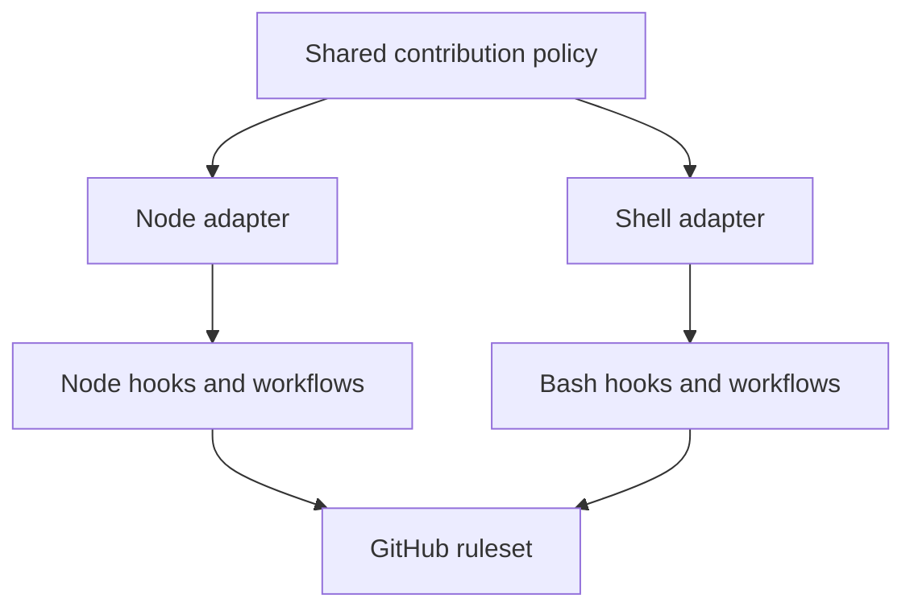

# Architecture

Repo Guardrails uses the adapter pattern: one Git contribution policy with environment-specific implementations.

| Adapter | Best for | Local enforcement |
| --- | --- | --- |
| `src/node` | Node.js repositories | Commitlint and Husky |
| `src/shell` | Shell-based repositories | Bash and Git hooks |

## Shared policy

Both adapters read the same branch-policy file, enforce the same branch naming convention and automation exemptions, preserve generated files, and use the same GitHub merge-protection model.

They do not share a runtime. Each adapter implements small validators in its native language, while shared conformance cases keep their branch rules aligned.

## Commit validation

The Node adapter uses Commitlint to validate full Conventional Commit messages. The dependency-free shell adapter validates commit subjects only: type, optional scope, and description. Both provide the same fast local feedback for common mistakes, but full message validation requires the Node adapter.

## Why adapters

A shell repository should not need Node.js to validate a branch name. A Node.js repository should keep its Commitlint and Husky integration. Adapters preserve both experiences without duplicating the policy.

## Adding an adapter

An adapter owns its installer, validators, local hooks, workflow templates, and conformance coverage. Implementations live under `src/<adapter>`; templates contain only files copied into target repositories. Each adapter must preserve existing target-repository files and use GitHub rulesets as the merge authority.
